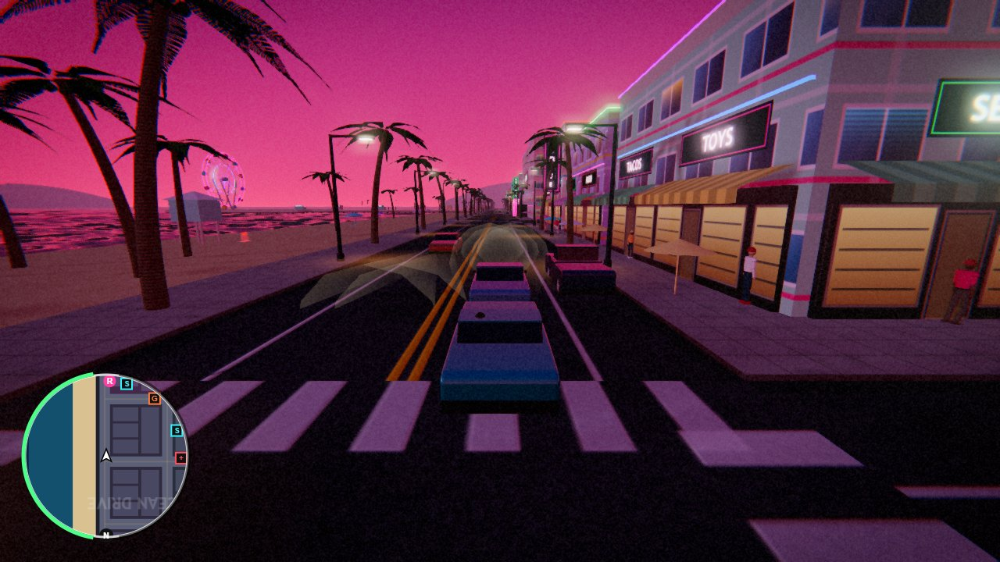
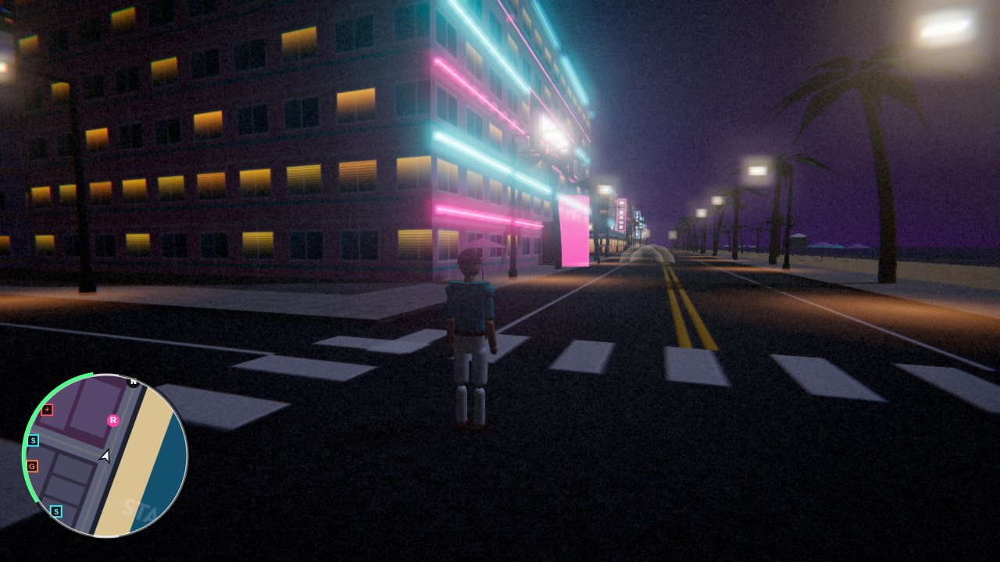
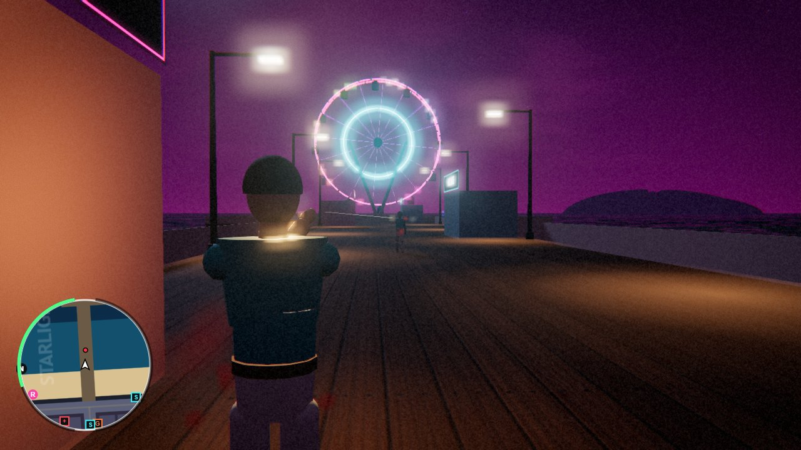
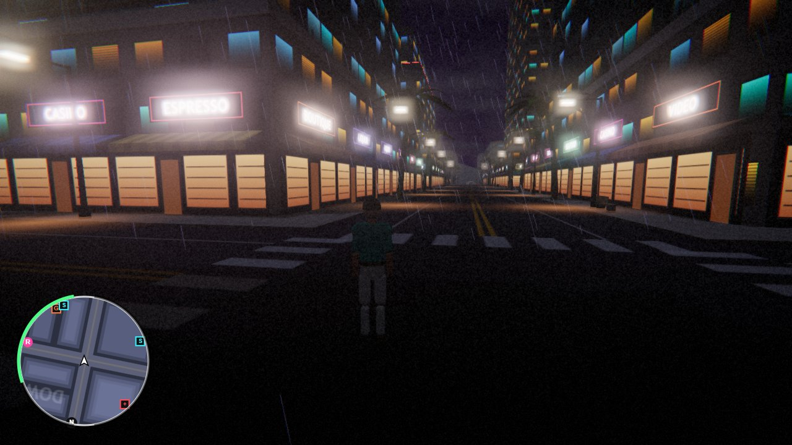
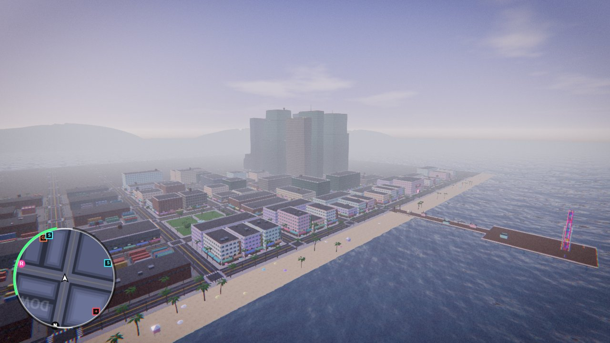

<div align="center">

# 🌴 SOLANO NIGHTS 🌴

**An open-world neon crime-city game that runs in your browser.**

*Solano Beach, 1986: palm trees, pink hotels, synthwave radio and a city full of trouble.*


<p>
  <a href="#-screenshots"><b>Screenshots</b></a> &nbsp;·&nbsp;
  <a href="#-quick-start"><b>Quick start</b></a> &nbsp;·&nbsp;
  <a href="#-controls"><b>Controls</b></a> &nbsp;·&nbsp;
  <a href="#-features"><b>Features</b></a> &nbsp;·&nbsp;
  <a href="#%EF%B8%8F-under-the-hood"><b>Under the hood</b></a> &nbsp;·&nbsp;
  <a href="#%EF%B8%8F-roadmap"><b>Roadmap</b></a>
</p>



</div>

---

## ⚡ At a glance

| | |
|---|---|
| 🎬 **Story** | Six original missions with two characters, Rosa and Dex |
| 🚗 **Driving** | Damage, skids, deep water and AI traffic that reacts to you |
| 🔫 **Combat** | Five weapon types, aim-down-sights, grenades and chain explosions |
| 🚨 **Police** | 1 to 5 star wanted level, pursuit cars and a helicopter at 4+ |
| 🌆 **World** | Day/night cycle, weather, rain and a full city generated at startup |
| 📦 **Assets** | None downloaded: everything is generated in code |
| 🛠️ **Setup** | Node.js 18+, no build step |

Solano Nights is a third-person open-world action game: drive, shoot, run from the cops and work
through a six-mission crime story in a fictional 1980s coastal city.

Everything is **generated in code at startup**: the city, buildings, textures, cars, characters,
animations, sky, sound effects and music. There are **no downloaded assets**, and nothing comes from
any existing game. All names, characters and places are original.

## 📸 Screenshots

| | |
|:---:|:---:|
|  |  |
| **Ocean Drive after dark** | **Shootout on Starlight Pier** |
|  |  |
| **Rain in downtown** | **The whole city from above** |

## 🚀 Quick start

You need **Node.js 18+** and a desktop browser (Chrome, Edge or Firefox).

```bash
git clone https://github.com/yash262626/solano-nights.git
cd solano-nights
npm install
npm start
```

Open **http://localhost:8080** and click **New Game**. Walk into the pink marker outside Club
Nocturne to meet Rosa and start the story.

> The only dependency is Three.js, loaded straight from `node_modules` through an import map, so
> there is no bundler and no build step.

## 🎮 Controls

| Action | Keys |
|---|---|
| Move / drive | `W` `A` `S` `D` |
| Look around | Mouse (click the game to lock the cursor) |
| Sprint / walk toggle | `Shift` / `C` |
| Jump / handbrake | `Space` |
| Enter, exit or steal a car | `F` |
| Interact (gun shop) | `E` |
| Aim / shoot | Right mouse / left mouse (drive-bys work with pistol and SMG) |
| Reload / switch weapon | `R` / mouse wheel, `1`–`6`, `Q` |
| Horn / radio / siren | `H` / `N` / `G` (siren only in a police car) |
| Map / pause | `M` / `Esc` |

## ✨ Features

### 🏙️ A living coastal city
- An **840 m × 840 m island city** with distinct districts:
  - Downtown glass towers
  - Art-Deco hotels on Ocean Drive
  - Midtown shopping streets
  - Palmetto suburbs with pools
  - The Docklands: cranes, containers and a cargo ship
  - Parks and a beach
  - Starlight Pier, which ends in a neon Ferris wheel
- **Day/night cycle** with a procedural sky (sun, moon, stars, clouds) and lit windows, neon signs
  and street-lamp glow after dark.
- **Weather**: clear, cloudy, rain and thunderstorms with wet, reflective roads.
- Real-time shadows, reflective cars and ocean, bloom, colour grading and film grain.

### 🚗 Vehicles
- **7 vehicles** with different handling: Coastal sedan, Marlin GT coupe, Bullet supercar, Cabbie
  taxi, Interceptor police cruiser, Hauler van and Dune pickup.
- Arcade physics with drifting, handbrake turns and body roll.
- **Damage**: dented bodywork, smoke, fire and explosions. Cars sink in deep water.
- **AI traffic** that follows the lanes, brakes for people, honks and panics when attacked.
- Skid marks when you slide.

### 🔫 Combat
- Fists, **Viper 9** pistol, **Hornet** SMG, **Breaker 12** shotgun, **Kestrel AR** rifle and
  **Firecracker** grenades.
- Aim-down-sights camera, recoil, spread, reloads, headshots, tracers, muzzle flashes, bullet holes
  and explosions with chain reactions.

### 🚨 Police and wanted level
- **1 to 5 stars.** Crimes need a police witness, or a civilian may phone it in.
  - 1 star: cops try to cuff you.
  - 2+ stars: they open fire, and pursuit cars hunt you through the streets.
  - 4+ stars: a **helicopter** with a searchlight and a gunner joins in.
- Escape by staying out of sight, or drive into a **Spray Shack** for a fresh coat of paint.

### 🎬 Story missions
Six missions from two original characters, **Rosa** (Club Nocturne) and **Dex** (Dex Auto Works):

| # | Mission | What happens |
|---|---|---|
| 1 | **Neon Welcome** | Deliver Rosa's Marlin GT to the garage without wrecking it |
| 2 | **Rush Order** | Pick up a package and race it across town before the timer runs out |
| 3 | **Pier Pressure** | Clear the Riptides gang off Starlight Pier |
| 4 | **Tail Lights** | Chase down the courier's car, then take out the courier |
| 5 | **Hot Wheels** | Steal a guarded supercar, lose the cops and deliver it to the docks |
| 6 | **Neon Crown** | Storm the gang warehouse, defeat boss Shark Vela and escape a 3-star chase |

Progress auto-saves. Pick **Continue** on the title screen to resume.

### 🖥️ HUD and audio
- Rotating minimap with blips, a full-screen map, health and armor bars, wanted stars, objective
  text, dialogue subtitles, mission timer and speedometer.
- **All sound is synthesized live**: weapons, engines, sirens, city, rain and ocean ambience, plus
  two procedural **synthwave radio stations**.

## ⚙️ Under the hood

- **Rendering:** Three.js r170, WebGL 2, PBR materials, PCF soft shadows, image-based lighting from
  the sky, UnrealBloom, ACES tone mapping, FXAA.
- **Performance:**
  - City geometry is merged per 168 m chunk, with frustum and distance culling.
  - Props are instanced per chunk, with LOD for small street furniture.
  - Cars render in 3–4 draw calls, and all wheels are one instanced draw.
  - People, cars, particles and decals are pooled. Traffic and pedestrians stream in around the
    player.
  - High / Medium / Low quality presets, plus automatic downgrade if the frame rate drops.
- **Physics:** a spatial-hash collision grid with DDA raycasts for bullets, line of sight and the
  camera.
- **Architecture:**
  - An event bus connects the gameplay systems.
  - Delayed actions use game time, so they pause correctly.
  - AI balance values live in one table (`src/tuning.js`).

<details>
<summary><b>Project layout</b></summary>

```
index.html        HUD, menus, styling and the import map
server.js         zero-dependency static server (localhost only)
src/main.js       boot, title and pause menus
src/game.js       renderer, post-processing, main loop, event handlers, save/load
src/events.js     event bus + game-time scheduler
src/world.js      procedural city generation (builder.js batches merged geometry)
src/sky.js        day/night cycle, sky shader, lighting, weather, rain
src/vehicles.js   car models, physics, damage, wheel instancing, skid marks, traffic AI
src/humanoid.js   procedurally built skinned characters + animation
src/character.js  shared character movement and damage
src/player.js     player controls, weapons, vehicles
src/npc.js        pedestrians, gang and police AI
src/police.js     wanted level, dispatch, helicopter
src/tuning.js     central AI balancing values
src/weapons.js    weapons, hitscan shooting, grenades, explosions
src/missions.js   mission framework + the six missions
src/hud.js        HUD, minimap, full map, gun shop
src/effects.js    particles, decals, tracers, light flashes
src/audio.js      procedural audio + radio
src/textures.js   procedural textures
src/physics.js    collision grid and raycasts
src/testkit.js    automated test helpers (?test)
src/tests.js      regression suite + benchmark (?test)
```
</details>

<details>
<summary><b>Automated tests and benchmark</b></summary>

Open `http://localhost:8080/?autostart&test` and use the browser console:

| Command | Purpose |
|---|---|
| `await T.suite()` | 11 regression tests: walking, driving, shooting, police, arrest, mission 1, save/load, pause, helicopter, pickups, resize |
| `await T.bench()` | Deterministic benchmark: draw calls, triangles and frame times for fixed camera views |
| `await T.heliProbe()` | Checks that spawning the helicopter doesn't recompile shaders |
| `await T.leakProbe()` | Checks that markers and pickups don't leak GPU resources |

The tests step the game at fixed time intervals, so they work even when the tab is in the
background. Screenshot captures (`T.shot`) need the server started with `npm run dev`.
</details>

## 🗺️ Roadmap

This repo is mid-way through a 10-iteration improvement plan.

**Iteration 1, foundation pass (in progress).**

Done:
- Helicopter hitch fix: spawning it no longer recompiles shaders (was a 178 ms freeze).
- Resource-leak fixes.
- Fewer per-frame allocations.
- About 35% fewer vehicle draw calls.
- Event bus.
- Central AI tuning table.
- Skid marks.
- A dev server that only listens on localhost.

Still to do:
- Character-to-character collision
- Surrender key
- Mission retry
- First-time control prompts
- Parked cars in lots
- Minimap and HUD polish

**Next iterations:**
- GPS route and waypoints
- Night lighting and reflections
- Combat feel and cover system
- Driving model v2
- Police search zones and roadblocks
- Cinematic missions
- A busier, more alive city
- A bigger map

---

## 📄 License

Released under the [MIT License](LICENSE). You are free to use, modify and share it, as long as the copyright notice stays.

<div align="center">
<sub>Built by <a href="https://github.com/yash262626">Yash Dhanraj Ail</a> · <a href="https://yashail.netlify.app">Portfolio</a></sub>
<br>
<sub>Original game. All names, characters, places and assets are fictional and procedurally generated.</sub>
</div>
